📍 **[arc42](README.md)** › Context and Scope

# 3. Context and Scope

## 3.1 Business Context

```mermaid
graph TB
    User["👤 User<br/><small>CLI Interface</small>"]
    CLI["🖥️ Keyline Planner<br/><small>CLI Engine</small>"]
    STAC["☁️ swisstopo STAC API<br/><small>data.geo.admin.ch</small>"]
    FS["💾 Local File System<br/><small>Cache + Outputs</small>"]
    
    User -->|stdin/stdout/exit| CLI
    CLI -->|HTTPS/STAC| STAC
    CLI -->|File I/O| FS
    STAC -->|elevation tiles| FS
    
    style User fill:#e1f5ff
    style CLI fill:#fff3e0
    style STAC fill:#f3e5f5
    style FS fill:#e8f5e9
```

| External System | Interface | Purpose |
|----------------|-----------|---------|
| **swisstopo STAC API** | HTTPS / STAC Item Search | Discover + download swissALTI3D elevation tiles |
| **Local file system** | File I/O | Tile cache, DEM artifacts, contour outputs, manifests |
| **User (CLI)** | stdin/stdout/stderr + exit codes | Invoke processing, receive results |

## 3.2 Technical Context

### Data Flow

```mermaid
graph TD
    A["📥 User Input<br/>AOI + Parameters"]
    B["🖥️ CLI Adapter<br/>Parse args → Call Engine"]
    C["⚙️ Engine Pipeline<br/><br/>1️⃣ Normalise AOI<br/>2️⃣ Discover Tiles<br/>3️⃣ Cache Tiles<br/>4️⃣ Build VRT Mosaic<br/>5️⃣ Clip DEM<br/>6️⃣ Generate Contours<br/>7️⃣ Write Outputs"]
    D["📊 Processing Result<br/>GeoJSON Contours<br/>+ Metadata"]
    
    A --> B
    B --> C
    C --> D
    
    style A fill:#e3f2fd
    style B fill:#fff3e0
    style C fill:#f3e5f5
    style D fill:#c8e6c9
```

### CRS Transformation

- Input: WGS84 (EPSG:4326) or LV95 (EPSG:2056)
- Processing: Always in LV95 (EPSG:2056)
- Output: LV95 (EPSG:2056) — matches source DEM

---

**Navigation:**  
⬅️ [Previous: Constraints](02-constraints.md) · [Overview](README.md) · [Next: Solution Strategy](04-solution-strategy.md) ➡️
