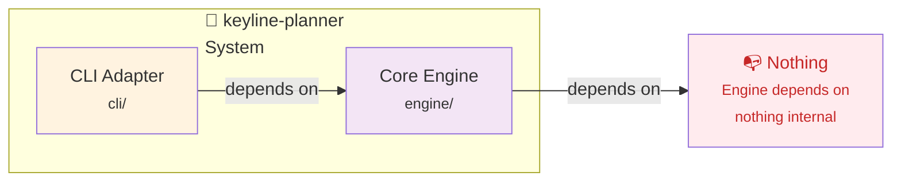
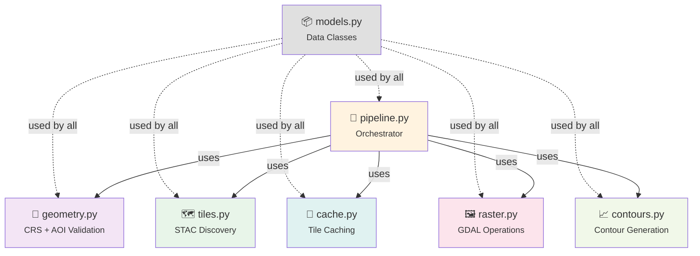

📍 **[arc42](README.md)** › Building Blocks

# 5. Building Block View

## 5.1 Level 1 — System Overview



**Dependency rule**: CLI depends on Engine. Engine depends on nothing internal.

## 5.2 Level 2 — Engine Modules

```
engine/
├── models.py      # Value objects: AOI, BBox, TileInfo, ContourParams, etc.
├── geometry.py     # AOI validation, CRS transformation, normalisation
├── tiles.py        # STAC tile discovery (network boundary)
├── cache.py        # Content-addressed tile + artifact caching
├── raster.py       # GDAL raster operations: VRT, clip, stats
├── contours.py     # Contour extraction + canonicalisation
└── pipeline.py     # Orchestrates modules into a complete workflow
```

### Module Responsibilities

| Module | Input | Output | Side Effects |
|--------|-------|--------|-------------|
| `models` | — | Data classes | None |
| `geometry` | GeoJSON / bbox + CRS | Normalised AOI (LV95) | None |
| `tiles` | AOI | List of TileInfo | Network (STAC API) |
| `cache` | TileInfo list | Local file paths | Disk I/O, Network |
| `raster` | File paths + AOI | Clipped DEM path | Disk I/O (GDAL) |
| `contours` | DEM path + params | GeoJSON path | Disk I/O (GDAL) |
| `pipeline` | User params | ProcessingResult | Composes all above |

### Dependency Graph (Engine Internal)



No circular dependencies. `models` is a leaf dependency.

---

**Navigation:**  
⬅️ [Previous: Solution Strategy](04-solution-strategy.md) · [Overview](README.md) · [Next: Crosscutting Concepts](08-crosscutting.md) ➡️
