📍 **[arc42](README.md)** › Quality Requirements

# 10. Quality Requirements

## 10.1 Quality Tree

```mermaid
graph TD
    Quality["🎯 Quality Goals"]
    
    Correctness["✅ Functional Correctness"]
    CorrectnessSub1["CRS ±0.01m"]
    CorrectnessSub2["Contour elevation match"]
    CorrectnessSub3["Tile selection coverage"]
    
    Determinism["🔁 Determinism"]
    DeterminismSub1["Identical I/O"]
    DeterminismSub2["Canonical ordering"]
    DeterminismSub3["Reproducible keys"]
    
    Testability["✓ Testability"]
    TestabilitySub1["≥80% coverage"]
    TestabilitySub2["Offline tests"]
    TestabilitySub3["CliRunner E2E"]
    
    Performance["⚡ Performance"]
    PerformanceSub1["≤1min@2m WC"]
    PerformanceSub2["≤5min@0.5m WC"]
    
    Maintainability["🔧 Maintainability"]
    MaintainabilitySub1["No cycles"]
    MaintainabilitySub2["<300 LOC/module"]
    
    Quality --> Correctness
    Quality --> Determinism
    Quality --> Testability
    Quality --> Performance
    Quality --> Maintainability
    
    Correctness --> CorrectnessSub1
    Correctness --> CorrectnessSub2
    Correctness --> CorrectnessSub3
    
    Determinism --> DeterminismSub1
    Determinism --> DeterminismSub2
    Determinism --> DeterminismSub3
    
    Testability --> TestabilitySub1
    Testability --> TestabilitySub2
    Testability --> TestabilitySub3
    
    Performance --> PerformanceSub1
    Performance --> PerformanceSub2
    
    Maintainability --> MaintainabilitySub1
    Maintainability --> MaintainabilitySub2
    
    style Quality fill:#fff9c4
    style Correctness fill:#c8e6c9
    style Determinism fill:#b2dfdb
    style Testability fill:#bbdefb
    style Performance fill:#ffe0b2
    style Maintainability fill:#f8bbd0
```

## 10.2 Quality Scenarios

| ID | Scenario | Measure | Target |
|----|----------|---------|--------|
| QS-1 | Agent modifies contour module | Existing tests pass | 100% |
| QS-2 | Same AOI processed twice | Output files byte-identical | Always |
| QS-3 | AOI in WGS84 submitted | Correctly reprojected to LV95 | ±0.01m |
| QS-4 | Tile download interrupted | Partial file cleaned up; retry works | Always |
| QS-5 | Flat DEM processed | No crash; 0-1 contours returned | Always |
| QS-6 | CI pipeline runs | All tests pass without network | Always |

---

**Navigation:**  
⬅️ [Previous: Architecture Decisions](09-decisions.md) · [Overview](README.md) · [Next: Risks & Technical Debt](11-risks.md) ➡️
